# Analisador Temporal Completo Habbo AS3 (2009 - 2026)
## `habbo-timeline` (Go) & `trace_timeline_full.py` (Protótipo Legado)

O **`habbo-timeline`** (binário nativo compilado em Go, disponível em `~/.local/bin/habbo-timeline`) é o pipeline definitivo de análise e correlação temporal de pacotes de rede do Habbo Hotel (ActionScript 3 Flash/AIR), cobrindo **17 anos contínuos de compilações (de 2009 até 2026)**, totalizando mais de 1.330 releases inspecionadas (~260 pré-shuffle e ~1.070 pós-shuffle).

> [!TIP]
> A implementação nativa em Go substitui o antigo `trace_timeline_full.py`, reduzindo a análise de ~5 minutos para **~8 segundos**, com descoberta semântica de nomes de variáveis a partir do AS3/WIN63 (`names.go`) e isolamento automático de sub-parsers.

---

## 1. As Três Eras do Protocolo Habbo

```mermaid
flowchart LR
    subgraph PRE["1. Pré-Shuffle (2009 - Set/2011)"]
        direction TB
        P1["Headers ESTÁTICOS"]
        P2["Mapeamento direto:<br/>_events[94] = ObjectRemoveEvent<br/>var_1414[96] = AssignRightsComposer"]
        P3["~260 Compilações analisáveis"]
    end

    subgraph FRONTIER["2. A Fronteira de Transição"]
        direction TB
        F1["RELEASE63-201109301501-135705747<br/>RELEASE63-201109282302-747691238"]
        F2["SWFs de Desenvolvimento da Sulake"]
        F3["Mantêm Headers Pré-Shuffle (94, 96)<br/>+ Possuem Messages.txt com MD5s"]
    end

    subgraph POST["3. Pós-Shuffle (Out/2011 - 2026)"]
        direction TB
        PO1["Headers RANDOMIZADOS a cada build"]
        PO2["Rastreamento por HabBit MD5<br/>+ Call-Site Matching (Callers)<br/>+ Catálogo da Sulek"]
        PO3["~470 Compilações analisáveis"]
    end

    PRE --> FRONTIER
    FRONTIER --> POST
```



### A) Era Pré-Shuffle (2009 até 30/09/2011)
* **Comportamento**: A Sulake mantinha os Header IDs absolutamente fixos e inalterados entre todas as compilações.
* **Exemplo**: O pacote `ObjectRemoveMessageEvent` foi sempre o Header **94** durante mais de 2 anos e centenas de builds.
* **Mapeamento**:
  ```actionscript
  _events[94] = ObjectRemoveMessageEvent;
  _composers[96] = AssignRightsMessageComposer;
  ```

### B) A Fronteira de Transição (Fim de Setembro de 2011)
* As compilações `RELEASE63-201109282302-747691238` e `RELEASE63-201109301501-135705747` foram compiladas pela Sulake no modo **Development**.
* **A brecha**: Elas utilizam a arquitetura pós-shuffle com tabela de mensagens indexada pelo HabBit, mas **ainda continham os Header IDs da era pré-shuffle estática**!
* **A utilidade**: São a **ponte perfeita** para transitar bidirecionalmente entre o passado estático e a era moderna randomizada.

### C) Era Pós-Shuffle (Outubro de 2011 até 2026)
* A Sulake passou a randomizar os IDs em todas as compilações (ex: Header 94 vira 585 em uma release, 470 em outra, 2703 em outra, etc.).
* Os pacotes precisam ser rastreados via AST de bytecode (Hashes HabBit MD5), similaridade fuzzy estrutural e correlação com catálogos como a Sulek.

---

## 2. As Pegadinhas de Engenharia Reversa e Suas Soluções

### Pegadinha #1: O Ruído do MD5 do HabBit
* **O Problema**: O HabBit gera o hash MD5 a partir dos opcodes de instruções e da **ordem dos traits/métodos na ABC (ActionScript Bytecode)**. Quando a Sulake recompilava o SWF (mesmo apenas trocando uma imagem ou corrigindo uma janela qualquer), a ordem dos traits podia oscilar. **O código fonte do pacote continuava rigorosamente o mesmo, mas o MD5 mudava.**
* **A Solução**: O script não assume que a mudança de MD5 significa mudança de pacote. Ele combina a persistência do MD5 com o **Fuzzy Matcher Estrutural** (`fuzzy_find_target`), que inspeciona a descompilação direta do código AS3 (`scripts.txt`).

---

### Pegadinha #2: Ambiguidade de Composers Triviais (1 Inteiro ou Vazio)
* **O Problema**: No Habbo AS3, um composer simples de envio de 1 inteiro tem apenas 5 linhas de código:
  ```actionscript
  class _-0GN implements IMessageComposer {
      private var _value: int;
      public function _-0GN(k: int) {
          this._value = k;
      }
      public function toArray(): Array {
          return [this._value];
      }
  }
  ```
  Existem **mais de 70 composers diferentes no cliente que têm essa mesma implementação idêntica** (`AssignRights`, `RemoveRights`, `KickUser`, `IgnoreUser`, `PassCarryItemToPet`, etc.).
  Quando o MD5 mudava, o SequenceMatcher de texto puro encontrava **1.00 de similaridade para todos os 70 candidatos**, fazendo o script escolher cegamente o primeiro e pular para um pacote completamente diferente (ex: pular de dar direitos para alimentar pet).

* **A Solução: Call-Site Matching (`extract_caller_contexts`)**:
  Como a classe do composer é trivial, **sua identidade semântica está em QUEM a instancia no cliente**. O script busca onde `new Composer(...)` é chamado:
  ```actionscript
  // O AssignRights é instanciado na janela de direitos:
  var _loc2_:IWindowContainer = IWindowContainer(param1.target);
  if (this._navigator) {
      this.send(new _-0GN(_loc2_.id));
  }
  ```
  Ao comparar os 76 candidatos contra o contexto de chamada da build anterior:
  * 75 candidatos tiveram score inferior a **0.58**.
  * O candidato real (`AssignRights`) teve score **1.000 (100% de certeza)**!

---

### Pegadinha #3: Refactors Grandes de Interface (O Caso do Novo Navegador)
* **O Problema**: Por volta de 2014/2015, a Sulake reescreveu todo o navegador do hotel ("Novo Navegador"), deletando o código do `HabboNavigator` antigo e movendo o botão de direitos para o `RoomPermissionsWidget`. Isso fez o call-site antigo sumir na coleção.
* **A Solução: Threshold Blindado de Confiança**:
  Para classes curtas e ambíguas, o script exige `min_threshold = 0.75` com validação de caller. Se uma interface foi apagada, ele não "chuta" um pacote de pets aleatório com score baixo; ele detecta a refatoração e evita falsos positivos.

---

### Pegadinha #4: Detecção de Pacotes Extintos (Early Abort)
* **O Problema**: Pacotes como o `OpenLockerRoomMessageEvent` (Header 96 incoming) foram descontinuados pela Sulake em março de 2013 (`RELEASE63-201303061127-810040751`). Sem um critério de parada, o script tentava escanear centenas de classes em 400 releases mortas, travando a execução por vários minutos.
* **A Solução**: Implementação do **Early Abort**:
  ```python
  MAX_CONSECUTIVE_MISSES = 5
  if consecutive_misses >= MAX_CONSECUTIVE_MISSES:
      print(f"[EARLY ABORT] Pacote não encontrado por 5 releases consecutivas. Marcado como extinto/removido.")
      break
  ```
  O tempo de execução caiu de **vários minutos** para **10 a 30 segundos**.

---

### Pegadinha #5: Auto-Enriquecimento pelo Catálogo Sulek
* **O Problema**: Quando um usuário pesquisa por um número antigo (ex: `94`), o script começa sabendo apenas o ponto da fronteira de 2011. As releases do final da coleção (2026) na pasta não tinham `Messages.txt` do HabBit, correndo o risco de acionar early abort logo antes de 2026.
* **A Solução**: Assim que o pacote navegando para frente atinge uma release mapeada no cache da Sulek (2016-2026), o script:
  1. Identifica o nome canônico (`ObjectRemoveMessageEvent`).
  2. Dispara o **Auto-Enriquecimento**: correlaciona instantaneamente todas as 138+ releases modernas da Sulek.
  3. Preenche as releases de 2026 diretamente, garantindo simetria absoluta entre buscas por ID numérico e por nome semântico.

---

## 3. Garantia de Inspeção Contínua de Estrutura

> [!IMPORTANT]
> O catálogo da Sulek fornece apenas o **Header ID** e a **Classe Ofuscada** (`asClass`). Ele **NÃO** congela nem dita os tipos de dados do pacote.

Para **cada compilação** encontrada ao longo dos 17 anos:
1. O script abre o código AS3 real da release (`scripts.txt`).
2. Localiza a classe e o `Parser` associado no `super()`.
3. Extrai instrução por instrução da função `parse()` a sequência exata de leitura (`readUTF`, `readBoolean`, `readInt`, etc.).
4. Compara `curr_struct != last_structure`.
5. Se a Sulake adicionou, removeu ou alterou o tipo de um campo, o script registra o momento exato da alteração e atualiza o arquivo de correlações.

---

---

## 4. Como Executar

O comando nativo compilado `habbo-timeline` está instalado no sistema em `~/.local/bin/habbo-timeline`:

### A) Por Header ID Pré-Shuffle (2009 - Set/2011):
```bash
# Rastreia um pacote Incoming
habbo-timeline 85 incoming
habbo-timeline 94 incoming

# Rastreia um pacote Outgoing (Composer)
habbo-timeline 96 outgoing
```

### B) Por Nome Semântico ou do Emulador:
```bash
# Rastreia o ciclo completo a partir do nome Sulek ou do emulador
habbo-timeline ROOM_FLOOR_ITEM_REMOVE
habbo-timeline ROOM_WALL_ITEM_UPDATE
habbo-timeline ItemUpdateMessageEvent
habbo-timeline ObjectUpdateMessageEvent
```

### C) Por Hash MD5 do HabBit:
```bash
habbo-timeline 7edf08f08b98370ea2a185c0583f5123
```

---

## 5. Artefatos Gerados

1. **Correlação de Transições Estruturais**:
   * Arquivo: `.agents/skills/timeline-as3/data/correlations/<packet>.json`
   * Contém **apenas** as builds em que houve mudança real de campos na rede, com datas e mapeamentos `isVersionAtLeast`.

2. **Banco Cumulativo no Formato Sulek**:
   * Arquivo: `.agents/skills/timeline-as3/data/packet_headers_database.json`
   * Estrutura cronológica contendo os Headers mapeados para cada build:
     ```json
     {
       "WIN63-202609021434-290314188": {
         "incoming": {
           "ObjectRemoveMessageEvent": 3677
         },
         "outgoing": {
           "AssignRightsMessageComposer": 2684
         }
       }
     }
     ```

3. **Código de Roteamento Kotlin**:
   * Gerado no stdout com a estrutura exata do emulador:
     ```kotlin
     habboResponse.apply {
         // Campo #1 (Histórico: String)
         writeUTF(...)

         // Campo #2 (Histórico: Int -> Boolean)
         if (isVersionAtLeast(2013, 3, 26)) {
             writeBoolean(...)
         } else {
             writeInt(...)
         }

         // Campo #3 (Histórico: Vazio -> Int)
         if (isVersionAtLeast(2011, 10, 20)) {
             writeInt(...)
         }

         // Campo #4 (Histórico: Vazio -> Int)
         if (isVersionAtLeast(2013, 3, 26)) {
             writeInt(...)
         }
     }
     ```
