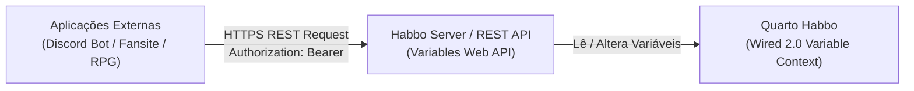

# Habbo Wired 2.0 - Variables Web API Documentation

> **Documentação Técnica Oficial dos Endpoints da Web API de Variáveis Wired 2.0**  
> Extraído a partir da especificação Swagger/OpenAPI oficial do Habbo Hotel (`VariablesWebApiAddon`).

---

## 📌 Visão Geral da Arquitetura

A **Web API de Variáveis Wired** permite que aplicações externas (Bots de Discord, Fã Sites, Painéis de RPG, Web Dashboards e Ferramentas Administrativas) consultem, modifiquem e gerenciem o estado das variáveis de um quarto em tempo real via **HTTPS / REST JSON**.



---

## 🔐 Autenticação e Níveis de Permissão

A autenticação é feita através das chaves geradas pelo Wired `VariablesWebApiAddon` (`wf_act_variables_web_api` / Addon Code `32`):

As chaves são enviadas no Header HTTP da requisição:
```http
Authorization: Bearer <API_KEY>
```
*ou via header customizado:*
```http
X-API-Key: <API_KEY>
```

### Níveis de Acesso:
1. **Chave de Leitura (Read Key)**:
   * Permite apenas requisições `GET`.
   * Visualização de variáveis (globais, mobis, usuários) e perfis.
2. **Chave de Escrita (Write Key)**:
   * Permite requisições `GET`, `PUT`, `PATCH`, `POST` e `DELETE`.
   * Permite manipular valores de variáveis individuais ou em lote (`batch`).
3. **Permissão Extra de Remoção em Massa (`bulk-delete`)**:
   * Requer **Write Key** + Checkbox `wiredfurni.params.web_api.permissions.bulk_delete` ativada na configuração do Wired dentro do jogo.
   * Permite invocar o endpoint perigoso `POST /api/public/rooms/{roomId}/variables/bulk-delete`.

---

## 📑 Lista Completa de Endpoints (OCR Swagger)

| Método | Endpoint | Permissão | Descrição |
|---|---|---|---|
| `GET` | `/api/public/rooms/{roomId}/variables` | Read / Write | List wired variables configured in a room. |
| `GET` | `/api/public/rooms/{roomId}/variables/{scope}/{variableName}/{targetKind}/{entityId}` | Read / Write | Read a single user or furni wired variable. |
| `PUT` | `/api/public/rooms/{roomId}/variables/{scope}/{variableName}/{targetKind}/{entityId}` | Write Key | Set a single user or furni wired variable. |
| `PATCH` | `/api/public/rooms/{roomId}/variables/{scope}/{variableName}/{targetKind}/{entityId}` | Write Key | Update a single user or furni wired variable. |
| `DELETE` | `/api/public/rooms/{roomId}/variables/{scope}/{variableName}/{targetKind}/{entityId}` | Write Key | Delete a single user or furni wired variable. |
| `GET` | `/api/public/rooms/{roomId}/variables/{scope}/{variableName}/{targetKind}` | Read / Write | List wired variable values for a target kind. |
| `GET` | `/api/public/rooms/{roomId}/variables/{scope}/{variableName}/{targetKind}/count` | Read / Write | Count wired variable values for a target kind. |
| `POST` | `/api/public/rooms/{roomId}/variables/bulk-delete` | Write Key + Bulk Perm | Delete multiple wired variables by name. |
| `POST` | `/api/public/rooms/{roomId}/variables/{scope}/{variableName}/batch` | Write Key | Execute a batch of wired variable operations. |
| `GET` | `/api/public/rooms/{roomId}/variables/global/{variableName}` | Read / Write | Read a global room wired variable. |
| `PATCH` | `/api/public/rooms/{roomId}/variables/global/{variableName}` | Write Key | Update a global room wired variable. |
| `GET` | `/api/public/rooms/{roomId}/variables_profile/user/users` | Read / Write | Read a user variables profile by name or unique_id. |
| `GET` | `/api/public/rooms/{roomId}/variables_profile/user/{targetKind}/{entityId}` | Read / Write | Read a user, pet, or bot variables profile. |
| `PATCH` | `/api/public/rooms/{roomId}/variables_profile/user/{targetKind}/{entityId}` | Write Key | Patch a user, pet, or bot variables profile. |
| `DELETE` | `/api/public/rooms/{roomId}/variables_profile/user/{targetKind}/{entityId}` | Write Key | Delete a user, pet, or bot variables profile. |
| `GET` | `/api/public/rooms/{roomId}/variables_profile/furni/{targetKind}/{entityId}` | Read / Write | Read a furni variables profile. |
| `PATCH` | `/api/public/rooms/{roomId}/variables_profile/furni/{targetKind}/{entityId}` | Write Key | Patch a furni variables profile. |
| `GET` | `/api/public/rooms/{roomId}/variables_profile/global` | Read / Write | Read the global variables profile. |
| `PATCH` | `/api/public/rooms/{roomId}/variables_profile/global` | Write Key | Patch the global variables profile. |

---

## 🔍 Detalhamento dos Parâmetros

### Parâmetros de Rota (Path Parameters)
* `{roomId}` *(int)*: ID do quarto onde o Wired Web API está configurado.
* `{scope}` *(string)*: Escopo da variável. Valores:
  * `room` / `global`: Escopo global do quarto.
  * `user`: Escopo de avatares (jogadores, bots, pets).
  * `furni`: Escopo de mobis/itens.
* `{variableName}` *(string)*: Nome da variável registrada no Wired (ex: `pontos`, `moedas`, `nivel`, `status`).
* `{targetKind}` *(string)*: Tipo de entidade alvo:
  * `user` (Jogador)
  * `bot` (Bot)
  * `pet` (Mascote)
  * `furni` (Mobília)
* `{entityId}` *(int | string)*: Identificador único do alvo (ex: ID do usuário, ID do mobi no quarto, ou identificador do bot).

---

## 🛠️ Exemplos de Requisição e Resposta

### 1. Consultar Variável de um Usuário
```http
GET /api/public/rooms/105/variables/user/pontos/user/48291 HTTP/1.1
Host: api.habbo.example.com
Authorization: Bearer 8f3d1b7a9c2e4f0a
```

**Resposta (`200 OK`):**
```json
{
  "room_id": 105,
  "scope": "user",
  "variable_name": "pontos",
  "target_kind": "user",
  "entity_id": 48291,
  "value": 1500,
  "updated_at": "2026-09-17T11:00:00Z"
}
```

---

### 2. Definir / Modificar Variável (`PUT` / `PATCH`)
```http
PUT /api/public/rooms/105/variables/user/pontos/user/48291 HTTP/1.1
Host: api.habbo.example.com
Authorization: Bearer 99a8b7c6d5e4f3a2
Content-Type: application/json

{
  "value": 2000
}
```

**Resposta (`200 OK`):**
```json
{
  "success": true,
  "room_id": 105,
  "variable_name": "pontos",
  "target_kind": "user",
  "entity_id": 48291,
  "old_value": 1500,
  "new_value": 2000
}
```

---

### 3. Operação em Lote (`POST /batch`)
Executa múltiplas alterações atômicas de uma só vez para evitar dezenas de chamadas HTTP:

```http
POST /api/public/rooms/105/variables/user/pontos/batch HTTP/1.1
Host: api.habbo.example.com
Authorization: Bearer 99a8b7c6d5e4f3a2
Content-Type: application/json

{
  "operations": [
    { "action": "set", "target_kind": "user", "entity_id": 48291, "value": 2500 },
    { "action": "set", "target_kind": "user", "entity_id": 10244, "value": 1800 },
    { "action": "increment", "target_kind": "user", "entity_id": 55120, "amount": 50 }
  ]
}
```

**Resposta (`200 OK`):**
```json
{
  "success": true,
  "processed_count": 3
}
```

---

### 4. Remoção em Massa (`POST /bulk-delete`)
> [!CAUTION]
> Requer que o dono do quarto tenha ativado expressamente a opção *"Permitir remoção em massa"* no Wired `VariablesWebApiAddon`.

```http
POST /api/public/rooms/105/variables/bulk-delete HTTP/1.1
Host: api.habbo.example.com
Authorization: Bearer 99a8b7c6d5e4f3a2
Content-Type: application/json

{
  "variable_names": [
    "temp_score",
    "event_stage"
  ]
}
```

**Resposta (`200 OK`):**
```json
{
  "success": true,
  "deleted_variables": [
    "temp_score",
    "event_stage"
  ],
  "total_records_cleared": 142
}
```

---

### 5. Perfil Completo de Variáveis de um Usuário
```http
GET /api/public/rooms/105/variables_profile/user/users?name=JohnDoe HTTP/1.1
Host: api.habbo.example.com
Authorization: Bearer 8f3d1b7a9c2e4f0a
```

**Resposta (`200 OK`):**
```json
{
  "user_id": 48291,
  "username": "JohnDoe",
  "room_id": 105,
  "variables": {
    "pontos": 2500,
    "moedas_rpg": 420,
    "classe_id": 3,
    "nivel": 15
  }
}
```

---

## ⚡ Integração com o Cliente AS3

No cliente Flash/Nitro, a interface do Wired é gerenciada por:
1. **`VariablesWebApiAddon.as`**:
   * Recebe as chaves configuradas (`onEditStart`).
   * Envia solicitações para gerar novas chaves (`onClickGeneratedReadKey`, `onClickGeneratedWriteKey`).
   * Confirmação visual da permissão perigosa de remoção em massa (`bulk_delete`).
2. **`HeaderPreset.as`**:
   * Exibe o botão **"Abrir documentação API"** (`wiredfurni.params.web_api.link`).
   * Ao clicar, abre a URL definida na variável externa `wired.api.docs.link` usando `HabboWebTools.openWebPageAndMinimizeClient`.
